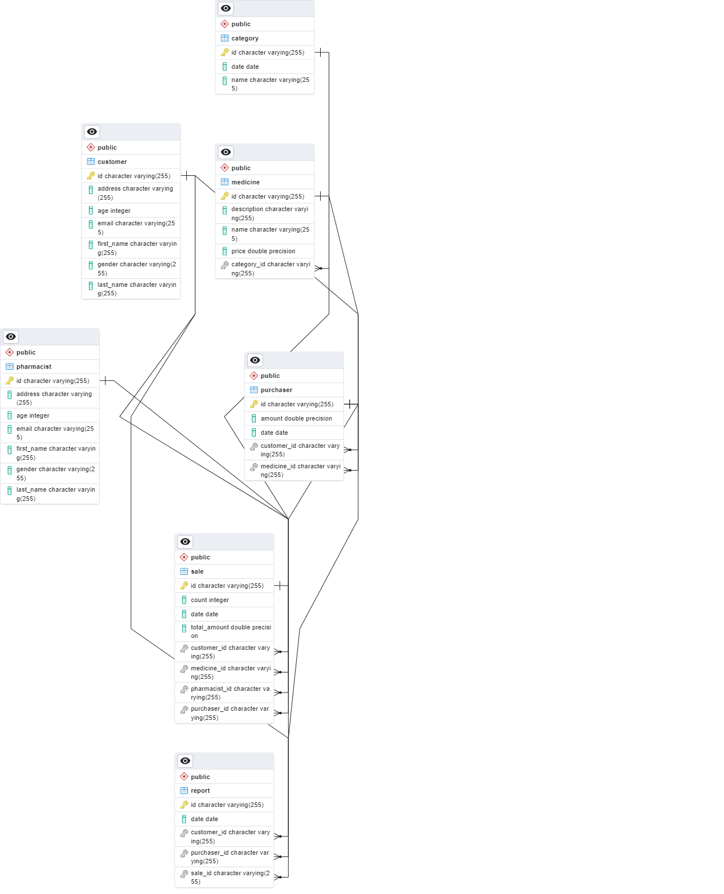

# Pharmacy Management System

## Description

This is a simple pharmacy management system.

## Getting Started

### Prerequisites

* Java 17
* Maven
* PostgreSQL

### Installing

* Clone the repository
* Open the project in your favorite IDE
* Run `mvn clean install` to build the project
* Create a database named `PharmacyManagementSystem` in Postgres
